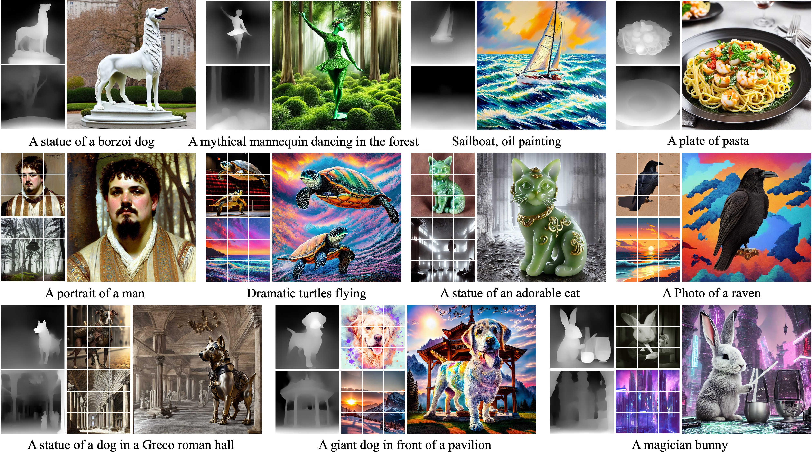
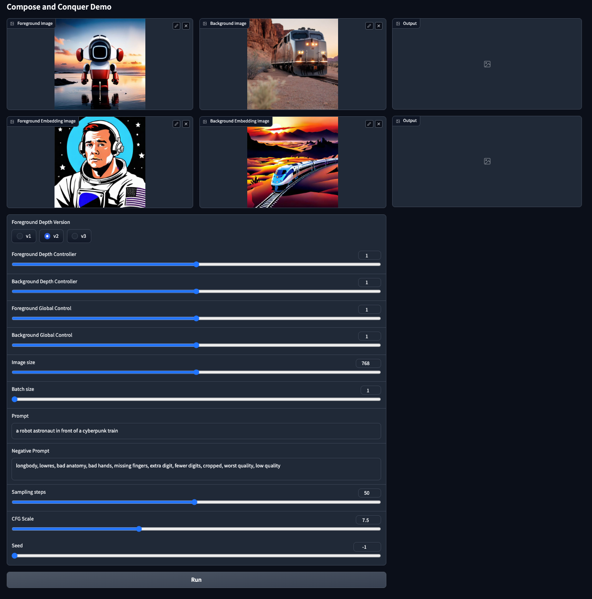

 # [ICLR 2024] Compose and Conquer: Diffusion-Based 3D Depth Aware Composable Image Synthesis

> **Compose and Conquer: Diffusion-Based 3D Depth Aware Composable Image Synthesis**<br>
> Jonghyun Lee, Hansam Cho, YoungJoon Yoo, Seoung Bum Kim, Yonghyun Jeong<br>
> 
>**Abstract**: <br>
Addressing the limitations of text as a source of accurate layout representation in text-conditional diffusion models, many works incorporate additional signals to condition certain attributes within a generated image. Although successful, previous works do not account for the specific localization of said attributes extended into the three dimensional plane. In this context, we present a conditional diffusion model that integrates control over three-dimensional object placement with disentangled representations of global stylistic semantics from multiple exemplar images. Specifically, we first introduce depth disentanglement training to leverage the relative depth of objects as an estimator, allowing the model to identify the absolute positions of unseen objects through the use of synthetic image triplets. We also introduce soft guidance, a method for imposing global semantics onto targeted regions without the use of any additional localization cues. Our integrated framework, Compose and Conquer (CnC), unifies these techniques to localize multiple conditions in a disentangled manner. We demonstrate that our approach allows perception of objects at varying depths while offering a versatile framework for composing localized objects with different global semantics.
 

## Description
Official implementation of Compose and Conquer: Diffusion-Based 3D Depth Aware Composable Image Synthesis.



## Updates
- 2024/1/16 Compose and Conquer has been accepted at ICLR 2024! see you at vienna

## To-Do
 - [ ] Diffusers integration


## Setup
For the time being, we recommend a conda environment:
```
conda env create -f environment.yaml
conda activate cnc
```

1. Download the [trained weights](https://drive.google.com/drive/folders/1kK1RbLs3bf08Hawwq9LU6jGfB3N7li2y?usp=sharing) and place it into the `trained_weights` folder. Note that we provide seperate weights for the full model (`cnc_v1.ckpt`), the local fuser (`local_fuser_v1.ckpt`), and the global fuser (`global_fuser_v1.ckpt`), and only the weights for the full model is required to run CnC. Feel free to tinker with the fusers.

2. Download the weights for the SOD module [U<sup>2</sup>-Net](https://github.com/xuebinqin/U-2-Net) either from their repository or [this link](https://drive.google.com/file/d/1kO3fbi8bd-EVrcfV0dKdcBTNuiJ8wf9G/view?usp=sharing), and place it in `annotator/u2net/weights`.

## Local Demo
Launch the gradio demo:
```
python src/test/test_cnc.py
```


The mask for Soft Guidance is automatically extracted from the foreground image via U<sup>2</sup>-Net.

## Training

### Dataset Preparation
For the official implementation, we've trained on the [COCO-Stuff Dataset](https://github.com/nightrome/cocostuff) and the [Pick-a-Pic Dataset](https://huggingface.co/datasets/yuvalkirstain/pickapic_v1). Our dataset preperation and training code follows a specific filetree convention:
```
base_dataset_dir/
├── train_captions.txt
├── train/
├── train_mask/
├── train_foreground/
├── train_foreground_depthmaps/
├── train_foreground_embeddings/
├── train_background/
├── train_background_depthmaps/
├── train_background_embeddings/
```

We've provided scripts to prepare the masks, foreground/background images, and its primitives in `data`. Here's a step by step example to prepare the COCO-Stuff dataset:
1. Set up the COCO-Stuff Dataset through instructions provided by their [repository](https://github.com/nightrome/cocostuff):

```
# Get this repo
git clone https://github.com/nightrome/cocostuff.git
cd cocostuff

# Download everything
wget --directory-prefix=downloads http://images.cocodataset.org/zips/train2017.zip
wget --directory-prefix=downloads http://images.cocodataset.org/zips/val2017.zip
wget --directory-prefix=downloads http://calvin.inf.ed.ac.uk/wp-content/uploads/data/cocostuffdataset/stuffthingmaps_trainval2017.zip

# Unpack everything
mkdir -p dataset/images
mkdir -p dataset/annotations
unzip downloads/train2017.zip -d dataset/images/
unzip downloads/val2017.zip -d dataset/images/
unzip downloads/stuffthingmaps_trainval2017.zip -d dataset/annotations/
```
2. Download the annotations folder that contain the text captions for COCO-Stuff. Note that the `dataset/annotations` folder contains the pixel-wise annotation images, and the text captions are not included, hence the additional download.

```
wget http://images.cocodataset.org/annotations/annotations_trainval2017.zip
unzip annotations_trainval2017.zip
```

3. extract the captions to a .txt file:

```
python data/parse_cocostuff.py
```

4. prepare the synthetic image triplets:

```
python data/get_mask_cocostuff.py
python data/get_foreground.py --base_dir "/path/to/cocostuff/dataset/images" --placeholder "train2017"
python data/get_background.py --base_dir "/path/to/cocostuff/dataset/images" --placeholder "train2017"
```

5. prepare the primitives (Depth maps, CLIP Image embeddings)

```
python data/get_primitives.py --base_dir "/path/to/cocostuff/dataset/images" --placeholder "train2017"
```

By this point, the filetree convention will be completed, and the cocostuff directory should look something like this:

```
|-- README.md
|-- cocostuff.bib
|-- dataset
|   |-- annotations
|   |   |-- train2017
|   |   |-- val2017
|   |-- images
|   |   |-- train2017
|   |   |-- train2017_captions.txt
|   |   |-- train2017_mask
|   |   |-- train2017_background
|   |   |-- train2017_background_depthmaps
|   |   |-- train2017_background_embeddings
|   |   |-- train2017_foreground
|   |   |-- train2017_foreground_depthmaps
|   |   |-- train2017_foreground_embeddings
```


### Global Fuser training
To train your own global fuser, first download the SD weights and place them in `ckpt`.

```
wget https://huggingface.co/runwayml/stable-diffusion-v1-5/resolve/main/v1-5-pruned.ckpt
```

Then extract weights from SD:
```
python utils/prepare_weights.py init_global ckpt/v1-5-pruned.ckpt configs/global_v15_v4_1.yaml ckpt/init_global.ckpt
```

and run `scripts/train_global_fuser.sh`. Make sure to edit the .yaml files to contain your `base_dir` and `placeholder` data flags. For the COCO-Stuff example above, the `--base_dir` would be `/path/to/cocostuff/dataset/images` and `--placeholder` would be `train2017`.

### Local Fuser training
To train your own local fuser, first download the [Uni-ControlNet weights](https://github.com/ShihaoZhaoZSH/Uni-ControlNet) and place them in `ckpt`.

Then extract weights from Uni-ControlNet:
```
python utils/prepare_weights.py init_local_fromuni ckpt/uni.ckpt configs/local_fuser_v1.yaml ckpt/init_local_fromuni.ckpt
```

and run `scripts/train_local_fuser.sh`.

### CnC Finetuning
Once both local and global fusers are trained, merge and finetune the model via:

```
python utils/prepare_weights.py integrate /path/to/your/localfuser.ckpt /path/to/your/globalfuser configs/cnc_v1.yaml init_cnc.ckpt

zsh train_cnc.sh
```

## Acknowledgements🤍
This repository is built upon [LDM](https://github.com/CompVis/latent-diffusion), [ControlNet](https://github.com/lllyasviel/ControlNet/tree/main), [Uni-ControlNet](https://github.com/ShihaoZhaoZSH/Uni-ControlNet), and [U<sup>2</sup>-Net](https://github.com/xuebinqin/U-2-Net). ya bois are the real mvps.
